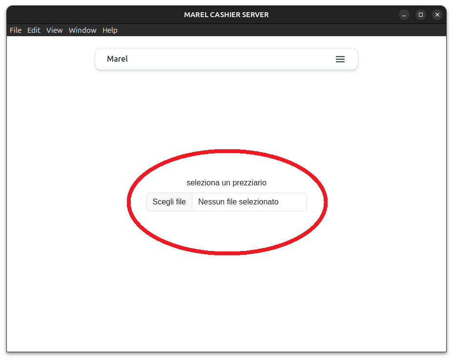

# CARICAMENTO PREZZI

 
 
 

## 1 Apri il menu

 

## 2 Seleziona la voce "Upload File"

 

## 3 Clicca sull'input di selezione file

 

## 4 Seleziona il file che vuoi caricare nella finestra che appare formati XLSX o CSV

 

## 5 Conferma il caricamento cliccando sul tasto verde "Carica"

